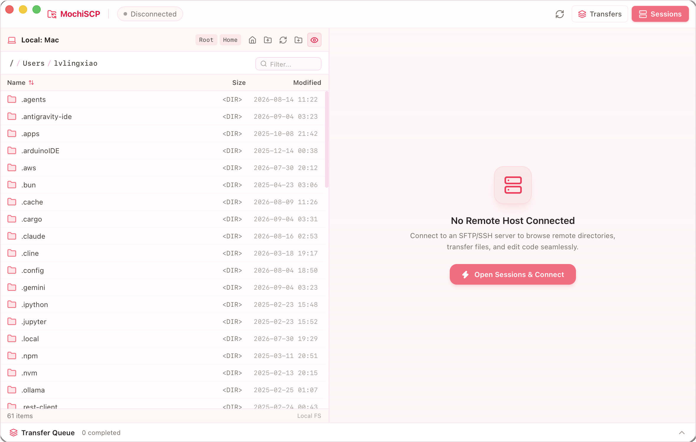

# 🍡 MochiSCP

<p align="center">
  
  <br />
  <strong>The sweetest, lightweight dual-pane SFTP/SCP client for macOS & Windows.</strong>
  <br />
  <sub>Inspired by classic WinSCP, redesigned with warm pastel pink aesthetics, ultra-fast native performance, and seamless external editor auto-sync.</sub>
</p>

<p align="center">
  <a href="#-features">Features</a> •
  <a href="#-preview">Preview</a> •
  <a href="#-getting-started">Getting Started</a> •
  <a href="#-shortcuts">Shortcuts</a> •
  <a href="#-license">License</a>
</p>

---

## 📸 Preview



---

## ✨ Features

- 🌸 **Free & Open Source**: Free forever and open source under the MIT license.
- ⚡ **Ultra-Lightweight & Blazing Fast**: Built with **Tauri 2 + Rust + React 19**, with a standalone app bundle size of only ~**12 MB** (installer DMG ~4.5 MB), compared to ~150–200 MB for typical Electron-based tools.
- 📂 **Direct `~/.ssh/config` Integration**: Zero proprietary session databases or lock-in. MochiSCP reads and writes directly to your standard `~/.ssh/config`. Existing terminal hosts appear automatically, and new or edited profiles are saved straight into `~/.ssh/config` with automatic safety backups (`config.bak`) and comments/directive preservation.
- 🔄 **Classic Dual-Pane Interface**: Classical Norton Commander / WinSCP dual-pane layout (Local filesystem on the left, Remote SFTP on the right).
- 🖱️ **Smooth Drag & Drop**: Native drag-and-drop between panes for instant uploads and downloads.
- 📝 **Remote File Edit & Auto-Sync**: Double-click remote files to open directly in your favorite editor (VS Code, Cursor, Zed, TextEdit); edits auto-sync back to the server upon save!
- 🛡️ **Zero-Credential Architecture**: For maximum security and frictionless cross-platform portability, passwords and passphrases are never stored on disk or platform keychains. Use standard SSH Public Keys (`IdentityFile`) or SSH Agent for seamless passwordless logins.
- 💻 **Integrated Terminal Launcher**: Launch native macOS Terminal or iTerm2 directly into the current remote directory with one click.

---

## 🚀 Getting Started

### Prerequisites
- [Node.js](https://nodejs.org/) & [pnpm](https://pnpm.io/)
- [Rust](https://www.rust-lang.org/) (`curl --proto '=https' --tlsv1.2 -sSf https://sh.rustup.rs | sh`)

### Development
```bash
# Install dependencies
pnpm install

# Start local dev mode with hot reload
pnpm tauri dev
```

### Production Build
```bash
# Build native release DMG & App bundle
pnpm tauri build
```
Built artifacts will be placed in:
- **macOS App**: `src-tauri/target/release/bundle/macos/MochiSCP.app` (~12 MB)
- **DMG Installer**: `src-tauri/target/release/bundle/dmg/MochiSCP_0.1.0_aarch64.dmg` (~4.5 MB)


---

## 📄 License
MIT License
